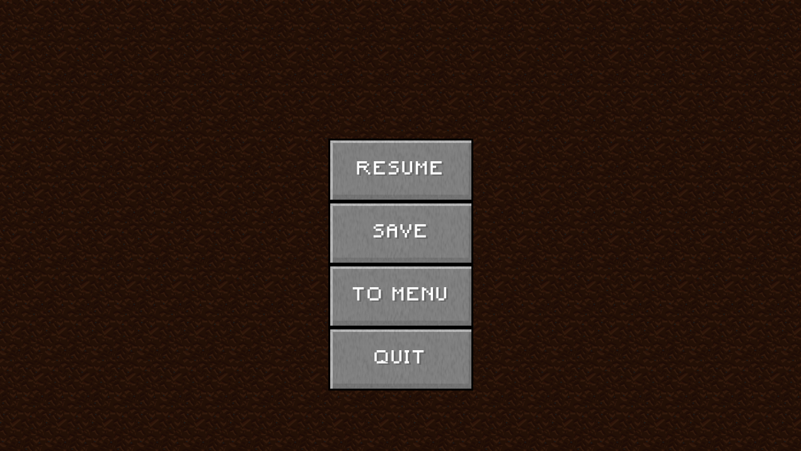

# TestCraft

TestCraft is two-dimensional variation on the popular computer game "Minecraft".

It was originally developed as a project for Object Oriented Programming course at Theoretical Computer Science, Jagiellonian University.

## Installation

[Here](https://github.com/jwajgelt/TestCraft/releases) you can download the final version.

## Controls

A/D - Move left/right

Spacebar - Jump

Left mouse button - Destroy blocks (hold down)

Right mouse button - Place block

E - Enter/exit equipment

ESC - Enter/exit in-game menu 

## Manual

Run Testcraft/bin/desktop.

Leaves and grass are swaying in the wind. Grass and flowers are spreading to a nearby dirt blocks. What a wonderful place to explore!

In equipment you can choose the item you have in your hand. It is important when you  destroy blocks. With axe you chop the tree faster, pickaxe allows you to mine rocks faster and collect them (otherwise they just disappear)
etc. It also determine the block you place with the right mouse button. The number in the bottom right corner is the number of items/blocks you have in your equipment.

Deeply underground there are some more interesting and harder minerals, caves and much more. Also remember not to jump from a height because you might lose your Hp!

In-game menu allows you to save the game, or go back to main menu.

## Authors

Juliusz Wajgelt

Piotr Olkuśnik

Jacek Salata

## Credits

Credit to [***Raymond "Raeleus" Buckley***](https://ray3k.wordpress.com/software/skin-composer-for-libgdx/) for Minecraft-ish libgdx skin.

## License
[MIT](https://choosealicense.com/licenses/mit/)
